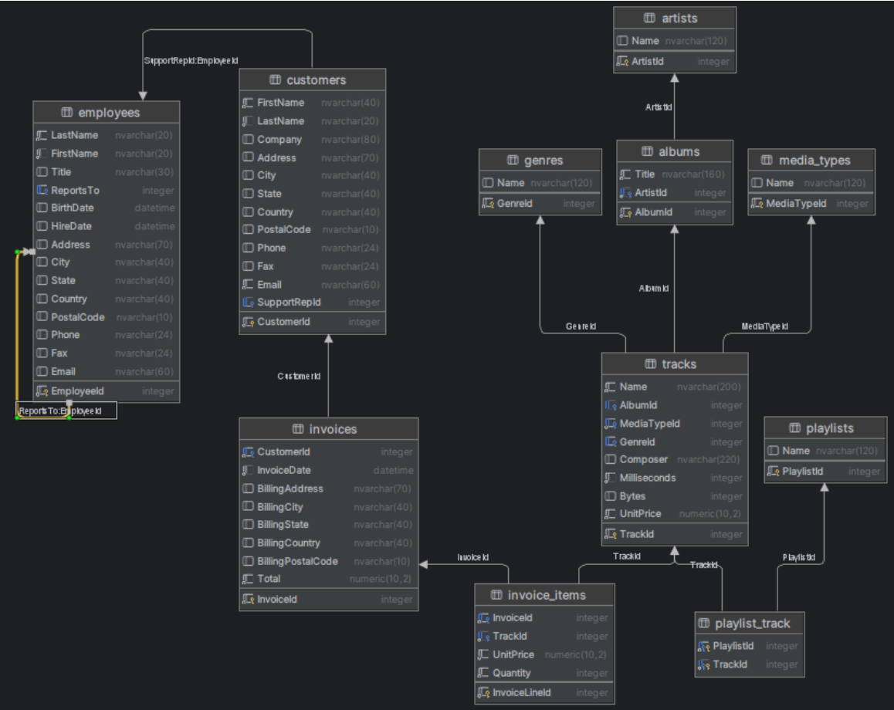

# Biblioteca-Medios-Digitales

## EVALUACIÓN PARCIAL

### Objetivo:
Poner en práctica lo aprendido acerca de programación en Java y desarrollo de Microservicios. Para
el desarrollo del presente parcial será necesario conocer:
• El lenguaje de Programación Java y sus diferentes librerías
• El administrador de proyectos Maven y su configuración y uso
• El framework Spring y los componentes específicos analizados en clase hasta el momento
• Los conceptos de desarrollo y testing de microservicios revisados.

### Introducción:
Se brinda al estudiante la base de datos Chinook, la base de datos Chinook es una base de datos de
ejemplo utilizada para probar funcionalidades de los motores de base de datos y que en este caso la
vamos a utilizar como repositorio de datos del ejercicio del parcial.
Esta base de datos contiene los datos de una biblioteca de medios digitales que pueden ser accedidos
para compra y reproducción, incluye tablas para artistas, álbumes, tracks, facturas, clientes y listas de
reproducción.
A continuación, un breve detalle acerca de las tablas que incluye la base de datos:
• Employees (Empleados): Almacena datos de los empleados, como su ID de empleado, apellidos,
nombres, etc. También incluye un campo llamado "ReportsTo" para especificar quién reporta a
quién.
• Customers (Clientes): Almacena datos de los clientes.
• Invoices (Facturas): Contiene datos de encabezado de facturas.
• Invoice_Items (Ítems_de_Factura): Almacena datos de los ítems de línea de las facturas.
• Artists (Artistas): Almacena información sobre los artistas, incluyendo sus IDs y nombres.
• Albums (Álbumes): Contiene datos relacionados con los álbumes.
• Media_Types (Tipos_de_Medios): Almacena tipos de medios, como archivos de audio MPEG y
AAC.
• Genres (Géneros): Almacena tipos de música, como rock, jazz, metal, etc.
• Tracks (Pistas): Contiene datos de las canciones (pistas).
• Playlists (Listas_de_Reproducción): Almacena información sobre las listas de reproducción.
• Playlist_Track (Pista_de_Lista_de_Reproducción): Refleja la relación entre las listas de
reproducción y las pistas. Se utiliza para representar esta relación de muchos a muchos.

Y el Diagrama de Entidad Relación de la BD mencionada:

### Enunciado:
Habiendo descripto previamente la base de datos a la que el estudiante tiene acceso, y podrá descargar
del link dispuesto para tal fin en el aula virtual, a continuación, describimos los requerimientos a
desarrollar de forma previa para poder enforcarse, el día del parcial, específicamente en los
requerimientos solicitados ese día:

1. Construir un proyecto de Spring boot que soporte, Spring data para conectarse a la base de
datos, Endpoints para dar respuesta a los requisitos aquí solicitados, Tests unitarios de estos
requisitos y la estructura interna vista en clase y acordada para la implementación.
  a. Puede o no usar lombok para la definición de las entidades y/o los dtos.
  b. Puede o no usar dtos y mapeos
2. Construir la estructura de endpoints CRUD (Crear, Obtener, Modificar y Borrar) para cada una de
las siguientes tablas: customer, invoice, invoice_items, track, playlist_track, playlist.
4. Para cada una de estas tablas se solicita al menos, capa de acceso a datos (Repositorio), capa de
negocio (Servicio) y capa de Interfaz (Controlador), además evidentemente de la Entidad de
datos.
5. Tener en cuenta que la tabla playlist_track es una relación pura con lo que el requerimiento pasa
por poder agregar o eliminar tracks a la playlist.
